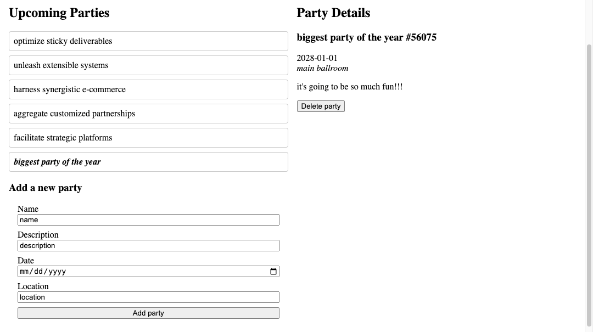

# Party Planner Admin



The [Fullstack Convention Center](https://fsa-crud-2aa9294fe819.herokuapp.com/api) hosts a variety of events, from small meetings to large galas. Previously, you built a public platform where visitors could get the latest information about upcoming events. Now, you'll build the admin interface to allow administrators to add or remove parties.

Read the [API documentation](https://fsa-crud-2aa9294fe819.herokuapp.com/api/#tag/Events). You will be working mainly with the `/events` endpoints.

## Features

The starter code for this workshop is the solution to the previous workshop! Read the provided code thoroughly. Write JS to implement the following features:

- Users can add a new party by submitting a form.
- Users can delete the selected party.

> [!WARNING]
>
> When you send a POST request to create a new party, the API is expecting the date to be an ISO string. The request will fail if you send an invalid date. To get a valid ISO string:
>
> 1. In your form, use `<input type="date"/>` to get the user's input as a date.
> 2. Convert the date to the right format:
>
> ```js
> const isoDate = new Date(dateFromForm).toISOString();
> ```
>
> 3. Send the ISO string in your POST request for the `date` field.

## Requirements

Your submission should meet the following requirements:

- `index.html` is not modified. All elements are generated via JS.
- The application renders a form where users can input the name, description, date, and location of a new party.
- The application is able to create a new party via a POST request to the API.
- The application renders a delete button for the selected party.
- The application is able to remove the selected party via a DELETE request to the API.
- The application is rerendered whenever state changes.
- UI elements are organized into component functions.

## Submission

Please submit the link to your public GitHub repository.
